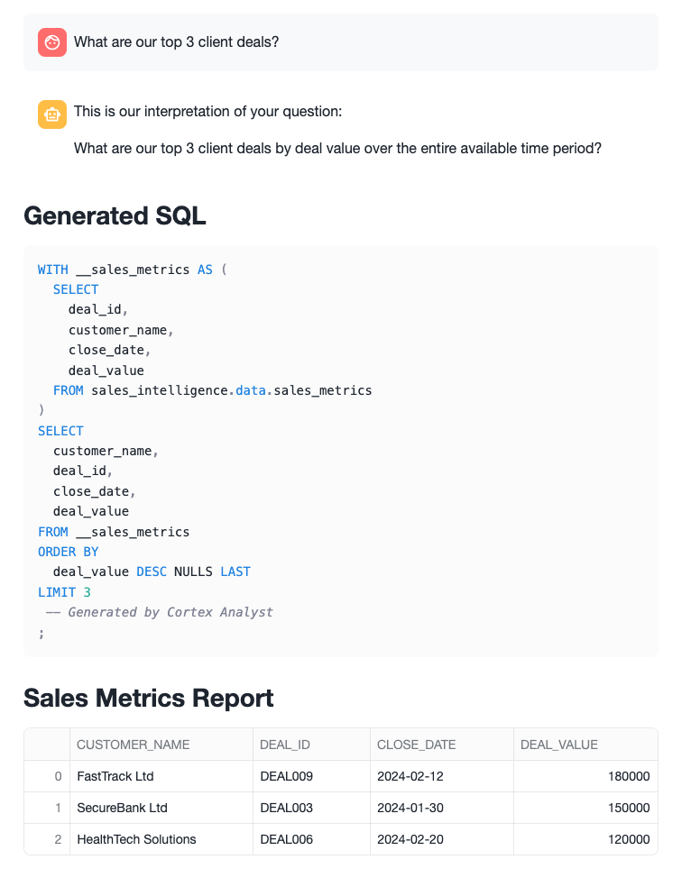
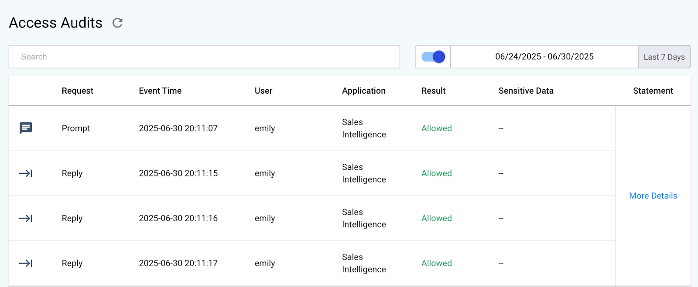
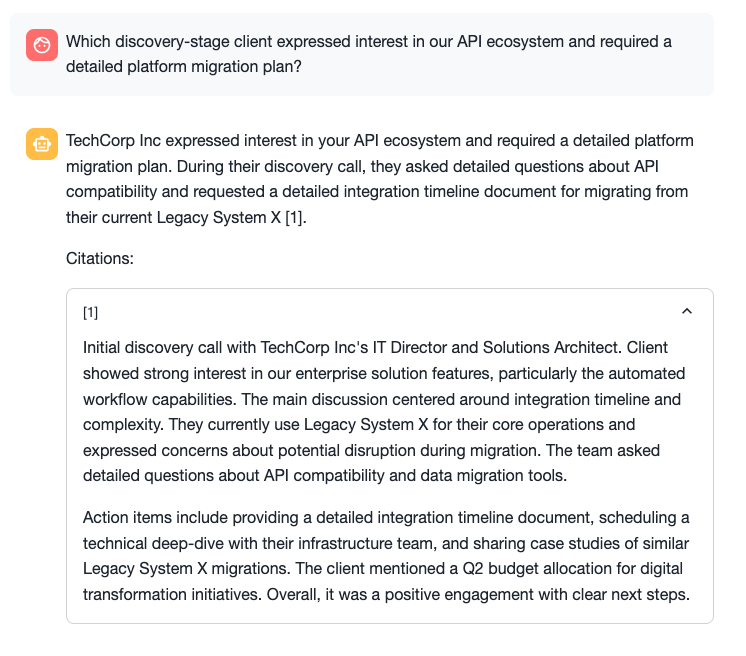
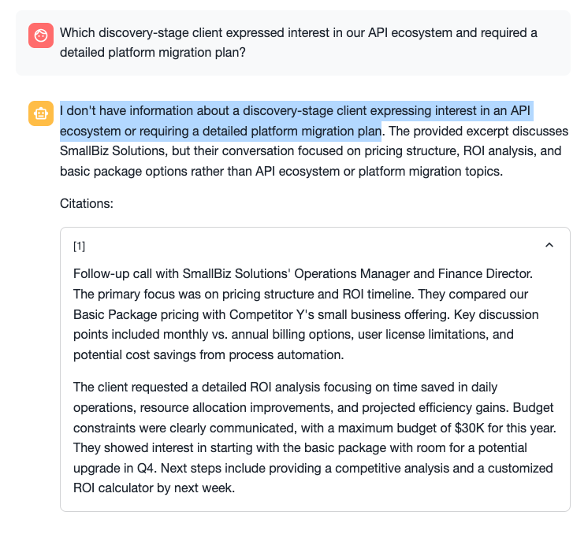
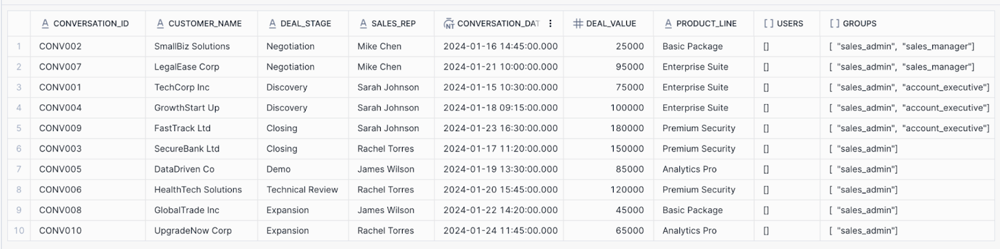
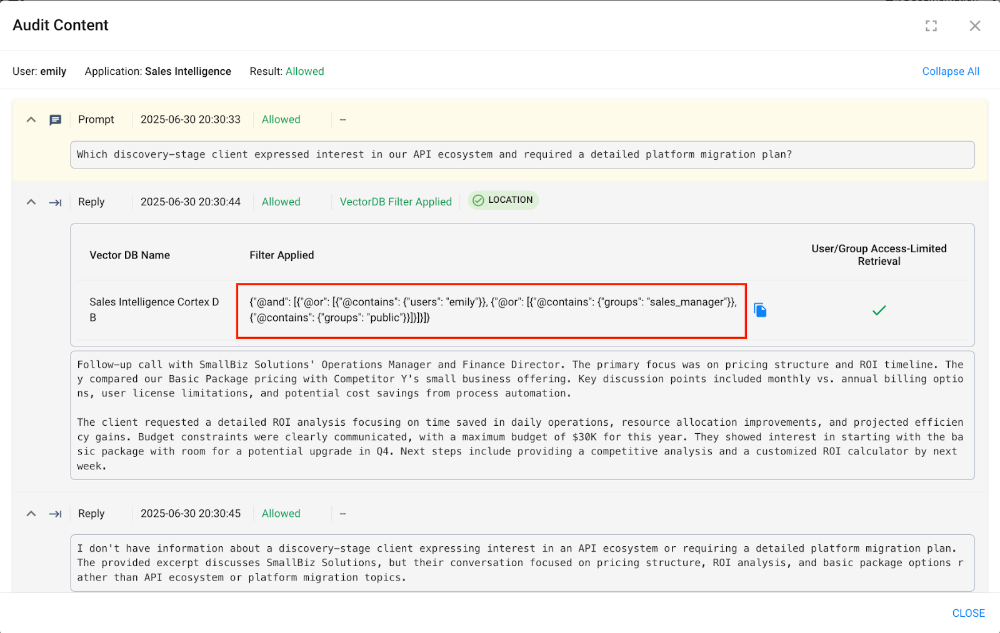

# Trust3 - Data Security & Compliance for Snowflake Cortex Apps

## Overview

**Trust3** empowers AI platform owners and security teams to enforce centralized, customizable, fine-grained content moderation and access controls — bringing enterprise-grade thoroughness and flexibility to any AI systems built using the **Snowflake Cortex platform**.

### 🔐 Key Features

#### ✅ Enhanced Content Moderation

Automatically detect and manage PII, toxic content, intellectual property, and other custom-defined content within AI applications. Trust3 allows immediate redaction, approval, or denial of such content based on centralized policies.

#### ✅ Unified Access Management

Consolidate and enforce fine-grained access policies across both **structured and unstructured data**, ensuring consistent control over who can access AI applications.

#### ✅ Data Security & Compliance

Maintain and enforce permissions on unstructured content when using **Cortex Search**, strengthening data security and compliance. Trust3 also offers centralized and detailed access logs, enabling effortless audit reporting and regulatory alignment.

## 🚀 Quickstart

In this guide, we'll demonstrate how to **safeguard and monitor conversations** in **LLM-powered applications** using Trust3.

As an example, we will build a simple **Intelligent Sales Assistant** using **Snowflake Cortex Agents** and **Streamlit**. This assistant simulates realistic LLM interactions and helps showcase how Trust3 can:

* Enforce AI guardrails
* Monitor usage
* Ensure secure and responsible AI behavior

Let’s get started!

## 📘 What You’ll Learn

* How to install and configure the **AI Trust Layer for Cortex** from the **Snowflake Marketplace**
* How to integrate **Trust3** with your **Streamlit** app to:

  * Enforce content and access guardrails
  * Monitor LLM interactions
  * Ensure responsible and secure AI usage

## 🛠️ What You’ll Build

* A **Sales Assistant Application** that allows users to:

  * Interact with sales data via **semantic search**
  * Perform **metrics analysis**
  * Ask questions using **LLM-powered Q\&A**
* End-to-end **safeguards and monitoring** of all assistant conversations using Trust3 to ensure:

  * Security
  * Compliance
  * Responsible AI behavior

## 🧰 What You’ll Need

### ✅ Snowflake Account

* Permissions to:

  * Create roles
  * Create databases and tables
  * Upload files
  * Create external access integrations
  * Install applications from the Snowflake Marketplace

### ✅ Access to Snowflake Cortex Services

* **Cortex Agents**
* **Cortex Search**
* **Cortex Analyst**

### ✅ AI Trust Layer for Cortex

* Available via the **Snowflake Marketplace**
* Required to safeguard and monitor LLM assistant conversations through Trust3

## ⚙️ Setup Workspace

### Step 1: Run Setup Script in Snowsight

1. Open **Snowsight** and create a new **SQL Worksheet**.
2. Open the `setup.sql` script and execute all statements from top to bottom.

This script will:

* Create required roles
* Create the database, schema, and warehouse
* Create tables for sales conversations and metrics
* Load sample sales data
* Enable change tracking for real-time updates
* Configure the Cortex Search service
* Create a stage for semantic models and Python packages

> **Note:** The script includes placeholders like `<YOUR_USER>` and `<YOUR_PRIMARY_ROLE>`. Replace them with your actual Snowflake username and role before running the script.

### Step 2: Upload the Semantic Model

1. Download the file `sales_metrics_model.yaml` from the github repository.

2. In Snowsight, go to:
   **Data → Databases → SALES\_INTELLIGENCE → DATA → Stages → MODELS**

3. Click **"+ Files"** in the top right corner.

4. Browse and select the `sales_metrics_model.yaml` file.

5. Click **Upload**.

### Step 3: Install AI Trust Layer for Cortex

1. Log in to your **Snowflake** account and navigate to:
   **Data Products → Marketplace**

2. Search for **AI Trust Layer for Cortex**.

3. Click on the application result and then click **Get** to install it.

4. Grant the necessary privileges and launch the application.

5. Follow the on-screen instructions to:

   * Create the external access integration
   * Verify the integration setup

6. Click **Check Service Status** to confirm the service is running.

7. Once the service is active, click **Get Service URL** and copy the endpoint.

> **Tip:** You’ll need this endpoint later during configuration.

8. Open the copied URL in a new browser tab. After authenticating with Snowflake, you will be redirected to the **Trust3 Portal**.

9. Log in using the default credentials:

   * **Username:** `admin`
   * **Password:** `welcome1`

## Create Trust3 Application

### Step 1: Create Vector DB for Snowflake Cortex Search

1. Log in to the **Trust3 Portal**.
2. In the left-hand navigation panel, click **Vector DB** under the **Navigator** section.
3. Click **CREATE VECTOR DB**.
4. In the form:

   * Set the **Type** to `Snowflake Cortex`
   * Enter a name for your vector database
5. Click **Create**.

Once created:

* You'll be redirected to the **Vector DB configuration page**.
* Navigate to the **Permissions** tab.
* Click the **edit** icon.
* Enable the toggle for **User/Group Access-Limited Retrieval**.
* Click **Save**.

### Step 2: Create Trust3 Application for Snowflake Streamlit Application

1. In the Trust3 Portal, go to the left-hand navigation and click **AI Applications** under the **Navigator**.
2. Click **CREATE APPLICATION**.
3. In the form:

   * Enter a name for your application.
   * From the dropdown, select the **Vector DB** you created in Step 1.
4. Click **Create**.

## 📊 Create Streamlit Application

### Step 1: Generate Trust3 Application API Key

1. Log in to the **Trust3 Portal**.
2. Click on **AI Applications** under the **Navigator**.
3. Navigate to the application you have created.
4. Go to the **API Keys** tab and click **Generate API Key**.
5. Provide the API key name and set the validity as per your requirements.
6. Click **Generate** and **save the API Key** — you’ll need it later.

### Step 2: Generate Snowflake PAT Token

1. Follow the instructions in the official Snowflake documentation:
   👉 [Generate a PAT Token](https://docs.snowflake.com/en/user-guide/programmatic-access-tokens#generating-a-programmatic-access-token)
2. Save this PAT token — you’ll need it later during configuration.

### Step 3: Upload Trust3 Python Packages to Snowflake

1. Download the following ZIP files from the github repository:

   * `trust3_common.zip`
   * `trust3_client.zip`
2. Navigate to:
   **Data » Databases » SALES\_INTELLIGENCE » DATA » Stages » PYTHON\_PACKAGES**
3. Click the **+ Files** button in the top right corner.
4. Upload both `.zip` files.
5. Click **Upload**.

### Step 4: Create Streamlit Application in Snowflake

1. In your Snowflake account, open the **left-hand navigation menu** and click on **Streamlit** under **Projects**.
2. Click on the **Streamlit App** button (top right).
3. In the dialog:

   * Set **Database** to `sales_intelligence`
   * Set **Schema** to `data`
   * Choose your **Warehouse**
4. Click **Create**

> **Note:** Ensure the database and schema match those used in the setup.

### Step 5: Configure the Streamlit Application

1. Copy the contents from `streamlit.py` from the github repository and paste it into your new Streamlit App.

2. Replace the placeholders in the code with your actual values:

   ```python
   <your-trust3-server-base-url>         # Trust3 Native App Endpoint (e.g., https://abcde-gk76548-demo.snowflakecomputing.app)
   <your-snowflake-pat-token>            # PAT token generated in Step 2
   <your-trust3-ai-app-api-key>          # API key from Step 1
   ```

3. Click the **three dots** icon on the top right corner of the app editor.

4. Go to **App Settings > External Networks** tab.

5. Enable the toggle for:
   `ALLOW_SNOWFLAKE_NATIVE_APPS_EAI`

6. Click on the **Packages** dropdown in the top-left corner.
   In the search field that appears, enter the following package names **one by one** and press **Enter** after each to install them into your environment:

   * `urllib3`
   * `cryptography`
   * `posthog`
   * `requests`
   * `pyjwt`
   * `jproperties`

> 💡 Make sure each package is fully installed before proceeding to the next.

7. **Run the Streamlit application.**

## 🔐 Safeguarding Cortex with Trust3

### 📘 Use Case 1: Auditing Conversations with Cortex Analyst via Trust3

#### 🧪 Try This in Your Streamlit Application

Ask the following question in your Streamlit app:

> **💬 "What are our top 3 client deals?"**

You will receive a response from the Cortex Analyst via the Streamlit application (see example in the screenshot below).



### 📊 View the Audit Logs in Trust3

To audit this conversation:

1. Navigate to the **Trust3 Portal**.
2. Go to **Observability > Access Audits**.
3. You will see the **latest entry** at the top for your recent conversation.



### 🔍 Dive Deeper

* Click on **More Details** to inspect the full **prompt and response trail** for that conversation.
* Expand each section to get detailed insight into the interaction — including system messages, user queries, and LLM-generated responses.

> 🛡️ This ensures complete visibility and traceability of every LLM interaction, enhancing both **security** and **compliance**.


## 📘 Use Case 2: Safeguarding Conversations with Cortex Search using Trust3

### 🎭 Step 1: Query as `account_executive` Role

1. In **Snowsight**, switch your role to **`account_executive`**.

2. Start the **Streamlit application**.

3. Ask the following question:

   > 💬 **"Which discovery-stage client expressed interest in our API ecosystem and required a detailed platform migration plan?"**

4. ✅ You will receive a **complete and expected response** from the Streamlit app.



5. Navigate to **Trust3 Portal → Observability → Access Audits** to view the audit trail.

   * You will see a **new top entry** representing this conversation.
   * Click **More Details** to view the prompt, response, and filters.

### 🎭 Step 2: Query as `sales_manager` Role

1. Now, **switch your role** in Snowsight to **`sales_manager`**.

2. Ask the **same question** again in the Streamlit app.

3. ❗This time, the **response will be different** — Trust3 has applied filtering based on your role.



### 🔍 Why the Answers Differ

* Trust3 applies **Dynamic Filtering** based on the user's current role.
* The underlying **context table used by Cortex** has a `groups` column, listing role access for each record.
* Only `account_executive` had access to the relevant row.
* Trust3 dynamically injected filters so that **Cortex Search retrieved only authorized context documents**.



### 🕵️ View Dynamic Filter in Audit Logs

* Go back to **Access Audits** in Trust3.
* Open the same conversation as `sales_manager`.
* Click on **More Details** to inspect the filters sent to Cortex.



> 🔐 **Trust3 ensures each user sees only what they’re authorized to see — without modifying your app logic.**

## 🏁 Conclusion & Resources

🎉 **Congratulations!**

You’ve successfully built a secure, AI-powered **Sales Assistant** that:

* ✅ Leverages the **analytical and semantic power of Snowflake Cortex**
* 🔐 Integrates **Trust3** to ensure **enterprise-grade safety, compliance, and control**

### ✅ What You Achieved in This Quickstart:

* 🛡️ Enforced **fine-grained access policies** and **content moderation** for LLM interactions
* 📝 **Monitored and audited** assistant conversations via Trust3’s **Access Audits**
* 📊 Analyzed **structured and unstructured data** securely using **Cortex Search** and **Cortex Analyst**
* 🤝 Combined **Trust3 + Cortex** to build **responsible, secure AI applications** that align with governance, compliance, and enterprise policies

### 📚 Resources

* 📘 **[Trust3 Documentation](https://docs.trust3.ai)**
  *Detailed guides, API references, and setup documentation.*

> 🚀 You're now equipped to bring **governed GenAI** to your enterprise using Snowflake Cortex and Trust3.
> Build smarter. Build safer. Build with Trust.
